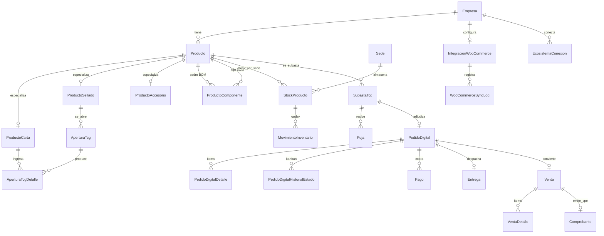
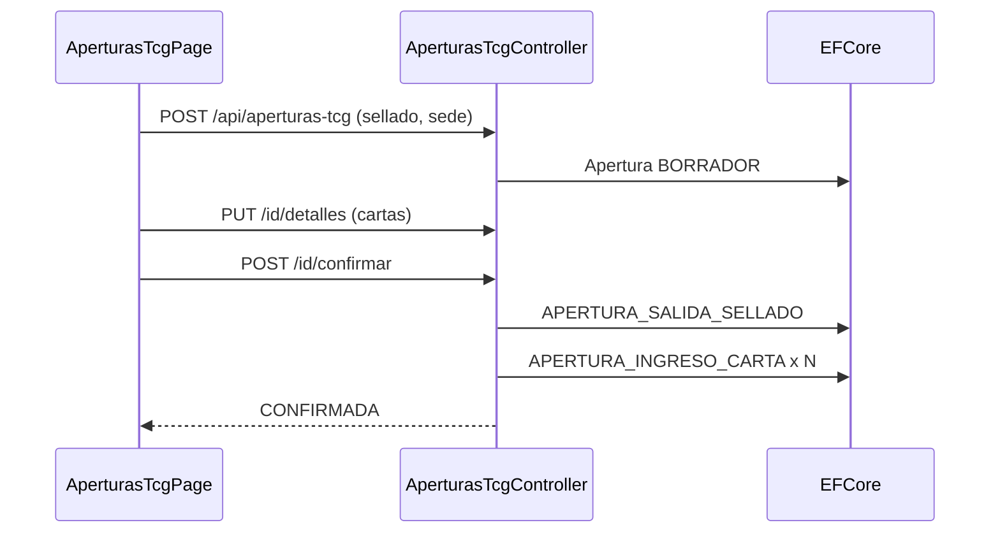

# Planificación inicial — CapitalPOS Web (Trunqi TCG)

Documento de planificación técnica de la especialización TCG de CapitalPOS para **Trunqi**. Define el modelo de datos, el contrato REST, el DTO de facturación SUNAT y la estructura Angular de los 11 módulos del sistema.

No es implementación. Es el blueprint contra el que se implementarán migraciones EF Core, controladores .NET y features Angular.

## 1. Propósito y stack

| Capa | Tecnología |
|------|------------|
| Frontend | Angular standalone (feature folders), tema **Clean Administrative** |
| API de negocio | ASP.NET Core + EF Core, multi-tenant (`EmpresaId`) |
| Facturación | API local ejecutable (`capitalpos-cpe-api`) — firma UBL y envío a SUNAT |
| Auth | JWT Bearer + header `X-CapitalPos-EmpresaId` + permisos de empresa |

**Tema visual Clean Administrative**

| Token | Valor | Uso |
|-------|-------|-----|
| Fondo de aplicación | `#F9FAFB` | `body`, shell, áreas de trabajo |
| Superficie / contenedor | `#FFFFFF` | cards, tablas, paneles Kanban, modales |
| Borde | `#E5E7EB` | contorno de contenedores y divisores |
| Acento | `#2563EB` | botones primarios, links, estados activos, badges |

Convenciones heredadas de CapitalPOS:

- Toda entidad transaccional lleva `EmpresaId`. El tenant activo llega por `X-CapitalPos-EmpresaId`.
- El stock vive por `SedeId`. El catálogo de productos es de empresa, no de sede.
- La emisión SUNAT **no** se hace desde Angular ni desde reglas fiscales embebidas en el POS: el API de negocio arma el JSON y lo envía al ejecutable local CPE.

## 2. Mapa de los 11 módulos

| # | Módulo | Tablas principales | Controlador | Feature Angular |
|---|--------|--------------------|-------------|-----------------|
| 1 | Dashboard | lecturas sobre stock, aperturas, subastas, pedidos | `DashboardController` | `features/dashboard` |
| 2 | Productos TCG | `productos`, `producto_cartas`, `producto_sellados`, `producto_accesorios`, `producto_componentes` | `ProductosTcgController` | `features/productos-tcg` |
| 3 | Inventario | `stocks_productos`, `movimientos_inventario`, `compras`, `compra_detalles` | `InventarioController` | `features/inventario` |
| 4 | Aperturas TCG | `aperturas_tcg`, `apertura_tcg_detalles` | `AperturasTcgController` | `features/aperturas-tcg` |
| 5 | Subastas TCG | `subastas_tcg`, `pujas` | `SubastasTcgController` | `features/subastas-tcg` |
| 6 | Pedidos Digitales | `pedidos_digitales`, `pedido_digital_detalles`, `pedido_digital_historial_estados` | `PedidosDigitalesController` | `features/pedidos-digitales` |
| 7 | Pagos | `pagos` | `PagosController` | `features/pagos` |
| 8 | Entregas | `entregas` | `EntregasController` | `features/entregas` |
| 9 | WooCommerce | `integraciones_woocommerce`, `woocommerce_sync_logs`, `woocommerce_mapeos_producto` | `WooCommerceController` | `features/woocommerce` |
| 10 | Reportes | lecturas (sin tablas propias) | `ReportesController` | `features/reportes` |
| 11 | Ecosistema | `ecosistema_conexiones` + disparo CPE | `EcosistemaController` | `features/ecosistema` |

Entidades de soporte (no son un módulo de UI propio, pero todas las tablas de negocio las referencian): `empresas`, `sedes`, `puntos_venta`, `clientes`, `usuarios`, `ventas`, `venta_detalles`, `comprobantes`, `configuracion_fiscal_empresa`, `series_comprobante`.

## 3. Modelo de Base de Datos (EF Core)

Estrategia de productos: **TPT por tipo TCG** sobre una tabla base `productos`. El discriminador `TipoProducto` evita mezclar rareza de carta con gramaje de funda en la misma fila, y permite FKs fuertes (una apertura solo puede consumir un `SELLADO`).



### 3.1 Convenciones

- Claves: `Guid`. Auditoría: `FechaCreacion` (`DateTimeOffset`) en todas las tablas transaccionales.
- Filtro global EF: `HasQueryFilter(e => e.EmpresaId == _empresaActivaId)` en entidades de negocio.
- FKs hijas se modelan con clave compuesta `(EmpresaId, PadreId)` cuando el padre es de empresa, para impedir fugas multi-tenant.
- `StockProducto.CantidadLibre` es columna computada: `CantidadDisponible - CantidadReservada`.

### 3.2 Productos TCG

#### `productos`

| Columna | Tipo | Notas |
|---------|------|-------|
| `Id` | `Guid` | PK |
| `EmpresaId` | `Guid` | FK `empresas` |
| `TipoProducto` | `enum` | `CARTA`, `SELLADO`, `ACCESORIO`, `COMPUESTO` |
| `Nombre` | `string(200)` | |
| `CodigoSku` | `string(64)` | único por empresa |
| `CodigoBarras` | `string(64)?` | |
| `PrecioVenta` | `decimal(18,2)` | precio con IGV |
| `Costo` | `decimal(18,4)?` | |
| `CategoriaId` | `Guid?` | |
| `MarcaId` | `Guid?` | juego / publisher (Pokémon, One Piece, etc.) |
| `Activo` | `bool` | |
| `FechaCreacion` | `DateTimeOffset` | |

#### `producto_cartas` (1:1 con `productos` cuando `TipoProducto = CARTA`)

| Columna | Tipo | Notas |
|---------|------|-------|
| `ProductoId` | `Guid` | PK / FK `productos` |
| `EmpresaId` | `Guid` | |
| `Juego` | `string(80)` | Pokémon, One Piece, Yu-Gi-Oh!, Lorcana, etc. |
| `SetCodigo` | `string(32)` | ej. `SV8`, `OP07` |
| `SetNombre` | `string(120)` | |
| `NumeroCarta` | `string(16)` | ej. `025/198` |
| `Rareza` | `enum` | `COMUN`, `INFRECUENTE`, `RARA`, `RARA_HOLO`, `ULTRA`, `SECRETA`, `ESPECIAL` |
| `Idioma` | `enum` | `ES`, `EN`, `JP`, `OTRO` |
| `Condicion` | `enum` | `NM`, `LP`, `MP`, `HP`, `DMG` |
| `EsFoil` | `bool` | |
| `Artista` | `string(120)?` | |

Una carta distinta (misma impresión, distinta condición o foil) es **otro producto** (otro SKU). No se usa variante talla/color del POS retail.

#### `producto_sellados` (1:1 cuando `TipoProducto = SELLADO`)

| Columna | Tipo | Notas |
|---------|------|-------|
| `ProductoId` | `Guid` | PK / FK |
| `EmpresaId` | `Guid` | |
| `Juego` | `string(80)` | |
| `Edicion` | `string(120)` | |
| `TipoSellado` | `enum` | `SOBRE`, `CAJA`, `CASE`, `TIN`, `COLECCION`, `OTRO` |
| `CartasEsperadas` | `int` | referencia al abrir (ej. 10 un sobre, 360 una caja) |
| `PermiteApertura` | `bool` | si `false`, solo se vende sellado |

#### `producto_accesorios` (1:1 cuando `TipoProducto = ACCESORIO`)

| Columna | Tipo | Notas |
|---------|------|-------|
| `ProductoId` | `Guid` | PK / FK |
| `EmpresaId` | `Guid` | |
| `TipoAccesorio` | `enum` | `FUNDAS`, `BINDER`, `PLAYMAT`, `DECKBOX`, `TOALLA`, `OTRO` |

#### `producto_componentes` (BOM de `COMPUESTO`)

| Columna | Tipo | Notas |
|---------|------|-------|
| `Id` | `Guid` | PK |
| `EmpresaId` | `Guid` | |
| `ProductoPadreId` | `Guid` | FK `productos` — debe ser `COMPUESTO` |
| `ProductoHijoId` | `Guid` | FK `productos` — carta, sellado o accesorio |
| `Cantidad` | `decimal(18,3)` | unidades del hijo por 1 padre |

Reglas:

- Un compuesto no puede contenerse a sí mismo ni a otro compuesto (BOM de un nivel).
- Armar un compuesto descuenta hijos y entra 1 padre (`ARMADO_COMPUESTO`).
- Desarmar hace el inverso (`DESARME_COMPUESTO`).

### 3.3 Inventario y Kardex

#### `stocks_productos`

| Columna | Tipo | Notas |
|---------|------|-------|
| `Id` | `Guid` | PK |
| `EmpresaId` | `Guid` | |
| `SedeId` | `Guid` | |
| `ProductoId` | `Guid` | |
| `CantidadDisponible` | `decimal(18,3)` | físico en sede |
| `CantidadReservada` | `decimal(18,3)` | pedidos/subastas no entregados |
| `CantidadLibre` | computada | `Disponible - Reservada` |

Único por `(EmpresaId, SedeId, ProductoId)`.

#### `movimientos_inventario`

| Columna | Tipo | Notas |
|---------|------|-------|
| `Id` | `Guid` | PK |
| `EmpresaId` | `Guid` | |
| `SedeId` | `Guid` | |
| `ProductoId` | `Guid` | |
| `TipoMovimiento` | `enum` | ver tabla abajo |
| `Cantidad` | `decimal(18,3)` | siempre positiva; el signo lo da el tipo |
| `StockAnterior` | `decimal(18,3)` | |
| `StockPosterior` | `decimal(18,3)` | |
| `ReferenciaTipo` | `string(40)?` | `APERTURA_TCG`, `SUBASTA_TCG`, `PEDIDO_DIGITAL`, `VENTA`, `COMPRA`, `ENTREGA`, `COMPUESTO` |
| `ReferenciaId` | `Guid?` | |
| `Motivo` | `string(500)?` | |
| `UsuarioId` | `Guid?` | |
| `FechaCreacion` | `DateTimeOffset` | |

#### `TipoMovimientoInventario`

| Valor | Efecto en stock | Origen típico |
|-------|-----------------|---------------|
| `AJUSTE` | ± disponible | inventario |
| `INGRESO_COMPRA` | + disponible | compras |
| `RESERVA` | + reservada (libre baja) | pedido o subasta ganadora |
| `LIBERACION_RESERVA` | − reservada | cancelación |
| `VENTA` | − disponible y − reservada | conversión a venta / entrega confirmada |
| `ANULACION_VENTA` | + disponible | anulación |
| `APERTURA_SALIDA_SELLADO` | − disponible sellado | confirmar apertura |
| `APERTURA_INGRESO_CARTA` | + disponible carta | confirmar apertura |
| `ARMADO_COMPUESTO` | − hijos / + padre | armar kit |
| `DESARME_COMPUESTO` | − padre / + hijos | desarmar kit |
| `PUJA_GANADORA_RESERVA` | + reservada | cierre de subasta |

El kardex es inmutable: no se edita ni se borra. Una anulación genera un movimiento inverso.

### 3.4 Aperturas TCG

Abrir un sellado es una transacción de inventario: sale 1 (o N) sellado(s) y entran las cartas resultantes en la misma sede.

#### `aperturas_tcg`

| Columna | Tipo | Notas |
|---------|------|-------|
| `Id` | `Guid` | PK |
| `EmpresaId` | `Guid` | |
| `SedeId` | `Guid` | |
| `ProductoSelladoId` | `Guid` | FK `productos` / `producto_sellados` |
| `CantidadSellados` | `int` | ≥ 1 |
| `Estado` | `enum` | `BORRADOR`, `CONFIRMADA`, `ANULADA` |
| `UsuarioId` | `Guid` | quien abre |
| `Observacion` | `string(500)?` | |
| `FechaCreacion` | `DateTimeOffset` | |
| `FechaConfirmacion` | `DateTimeOffset?` | |

#### `apertura_tcg_detalles`

| Columna | Tipo | Notas |
|---------|------|-------|
| `Id` | `Guid` | PK |
| `AperturaTcgId` | `Guid` | |
| `EmpresaId` | `Guid` | |
| `ProductoCartaId` | `Guid` | FK carta (debe existir en catálogo) |
| `Cantidad` | `int` | ≥ 1 |
| `CostoUnitarioAsignado` | `decimal(18,4)?` | prorrateo opcional del costo del sellado |

Al **confirmar**:

1. Validar `PermiteApertura` y stock libre del sellado.
2. Kardex `APERTURA_SALIDA_SELLADO` por `CantidadSellados`.
3. Por cada detalle, kardex `APERTURA_INGRESO_CARTA`.
4. Estado → `CONFIRMADA`.

Anular una confirmada genera movimientos inversos. No se anula si alguna carta ingresada ya fue vendida o reservada (stock libre insuficiente).

### 3.5 Subastas TCG y pujas

#### `subastas_tcg`

| Columna | Tipo | Notas |
|---------|------|-------|
| `Id` | `Guid` | PK |
| `EmpresaId` | `Guid` | |
| `SedeId` | `Guid` | sede que reserva al cerrar |
| `ProductoId` | `Guid` | carta, sellado, accesorio o compuesto |
| `Titulo` | `string(200)` | |
| `Canal` | `enum` | `FACEBOOK_SUBASTA`, `WEB`, `PRESENCIAL`, `OTRO` |
| `PrecioBase` | `decimal(18,2)` | |
| `IncrementoMinimo` | `decimal(18,2)` | |
| `PrecioReserva` | `decimal(18,2)?` | si no se alcanza, no adjudica |
| `FechaInicio` | `DateTimeOffset` | |
| `FechaCierre` | `DateTimeOffset` | |
| `Estado` | `enum` | `BORRADOR`, `ACTIVA`, `CERRADA`, `CANCELADA` |
| `PujaGanadoraId` | `Guid?` | |
| `PedidoDigitalId` | `Guid?` | pedido generado al adjudicar |
| `Observacion` | `string(500)?` | |

#### `pujas`

| Columna | Tipo | Notas |
|---------|------|-------|
| `Id` | `Guid` | PK |
| `EmpresaId` | `Guid` | |
| `SubastaTcgId` | `Guid` | |
| `ClienteId` | `Guid?` | si el postor ya es cliente |
| `NombrePostor` | `string(160)` | alias Facebook / nombre |
| `Monto` | `decimal(18,2)` | > última puja + incremento |
| `Fecha` | `DateTimeOffset` | |
| `EsGanadora` | `bool` | se marca al cerrar |

Al **cerrar y adjudicar**:

1. Elegir la puja máxima ≥ `PrecioReserva` (si hay).
2. Reservar 1 unidad (`PUJA_GANADORA_RESERVA`).
3. Crear `PedidoDigital` en `PendientePago`, canal `FACEBOOK_SUBASTA` (o el de la subasta), total = monto ganador.
4. Vincular `PedidoDigitalId`.

Cancelar una subasta activa no toca stock. Cancelar una cerrada con pedido exige cancelar el pedido (libera reserva).

### 3.6 Pedidos digitales (Kanban)

Reutiliza el agregado CapitalPOS. Columnas del tablero = estados.

#### `pedidos_digitales`

| Columna | Tipo | Notas |
|---------|------|-------|
| `Id` | `Guid` | PK |
| `EmpresaId` | `Guid` | |
| `ClienteId` | `Guid?` | |
| `SedeId` | `Guid` | reserva en esta sede |
| `PuntoVentaId` | `Guid?` | caja al convertir a venta |
| `CanalPedido` | `enum` | `FACEBOOK_SUBASTA`, `FACEBOOK_MARKETPLACE`, `WHATSAPP`, `INSTAGRAM`, `TIKTOK`, `WOOCOMMERCE`, `WEB`, `OTRO` |
| `Estado` | `enum` | ver máquina de estados |
| `FechaPedido` | `DateTimeOffset` | |
| `Subtotal` / `Igv` / `Total` | `decimal(18,2)` | |
| `ReferenciaExterna` | `string(80)?` | id Woo / post Facebook |
| `Observacion` | `string(500)?` | |
| `SubastaTcgId` | `Guid?` | si nació de una subasta |

#### `pedido_digital_detalles`

`PedidoDigitalId`, `ProductoId`, `Descripcion`, `Cantidad`, `PrecioUnitario`, `Total`.

#### `pedido_digital_historial_estados`

`PedidoDigitalId`, `EstadoAnterior?`, `EstadoNuevo`, `UsuarioId?`, `Fecha`, `Observacion?`.

Máquina de estados (solo adelante, salvo cancelar):

```
PendientePago → Pagado → Empaquetado → PendienteEntrega → Entregado
                      ↘ Cancelado (cualquier estado excepto Entregado)
```

- Crear pedido: reserva stock (`RESERVA`).
- Cancelar: `LIBERACION_RESERVA`.
- `Entregado` solo vía confirmar entrega (o `convertir-venta` si es recojo en tienda). Eso crea `Venta`, confirma reserva (`VENTA`) y habilita CPE.

### 3.7 Pagos (Yape / Izipay)

Módulo de primer nivel. Un pago puede nacer notificado (voucher Yape, webhook Izipay) y asociarse después a un pedido o a una venta.

#### `pagos`

| Columna | Tipo | Notas |
|---------|------|-------|
| `Id` | `Guid` | PK |
| `EmpresaId` | `Guid` | |
| `Origen` | `enum` | `YAPE`, `IZIPAY`, `EFECTIVO`, `TRANSFERENCIA`, `OTRO` |
| `Estado` | `enum` | `NOTIFICADO`, `ASOCIADO`, `CONFIRMADO`, `RECHAZADO` |
| `Monto` | `decimal(18,2)` | > 0 |
| `CodigoOperacion` | `string(80)?` | nro. operación Yape / id Izipay |
| `ReferenciaExterna` | `string(120)?` | payload crudo resumido |
| `PedidoDigitalId` | `Guid?` | |
| `VentaId` | `Guid?` | |
| `FechaNotificacion` | `DateTimeOffset` | |
| `FechaConfirmacion` | `DateTimeOffset?` | |
| `UsuarioAsocioId` | `Guid?` | cajera que vinculó |
| `Observacion` | `string(500)?` | |

Flujo:

1. `NOTIFICADO` — entra a la bandeja (manual o webhook).
2. `ASOCIADO` — se vincula a pedido/venta; si el pedido estaba `PendientePago` y la suma de pagos asociados ≥ total, el pedido pasa a `Pagado`.
3. `CONFIRMADO` — se congela; al convertir a venta se copia a `venta_pagos` para caja y CPE.
4. `RECHAZADO` — no suma.

La suma de pagos `CONFIRMADO` de un pedido no puede superar el `Total` del pedido.

### 3.8 Entregas

Hoy CapitalPOS solo tiene el estado `PendienteEntrega`. Trunqi modela la entrega como entidad (courier, tracking, dirección).

#### `entregas`

| Columna | Tipo | Notas |
|---------|------|-------|
| `Id` | `Guid` | PK |
| `EmpresaId` | `Guid` | |
| `PedidoDigitalId` | `Guid` | 1:1 con pedido en curso |
| `SedeOrigenId` | `Guid` | |
| `DestinatarioNombre` | `string(160)` | |
| `DestinatarioTelefono` | `string(32)?` | |
| `Direccion` | `string(300)` | |
| `Distrito` / `Provincia` / `Departamento` | `string(80)` | |
| `Courier` | `string(80)?` | Olva, Shalom, recojo, etc. |
| `NumeroTracking` | `string(80)?` | |
| `CostoEnvio` | `decimal(18,2)` | informativo; no altera IGV del pedido salvo regla futura |
| `Estado` | `enum` | `PROGRAMADA`, `DESPACHADA`, `EN_TRANSITO`, `ENTREGADA`, `FALLIDA` |
| `FechaProgramada` | `DateTimeOffset?` | |
| `FechaDespacho` | `DateTimeOffset?` | |
| `FechaEntrega` | `DateTimeOffset?` | |
| `Observacion` | `string(500)?` | |

Confirmar `ENTREGADA`:

1. Pedido → `Entregado`.
2. Crear `Venta` (canal según pedido) con caja abierta en el `PuntoVentaId`.
3. Kardex `VENTA` (confirma reserva).
4. El módulo Ecosistema puede disparar emisión CPE sobre esa venta.

### 3.9 WooCommerce

#### `integraciones_woocommerce`

| Columna | Tipo | Notas |
|---------|------|-------|
| `Id` | `Guid` | PK |
| `EmpresaId` | `Guid` | 1 config activa por empresa |
| `UrlTienda` | `string(300)` | |
| `ConsumerKeyCifrado` | `string` | no persistir en claro |
| `ConsumerSecretCifrado` | `string` | |
| `SedeOrigenId` | `Guid` | stock que se publica |
| `ModoSincronizacion` | `enum` | `MANUAL`, `PROGRAMADA` |
| `Activa` | `bool` | |

#### `woocommerce_mapeos_producto`

`ProductoId` ↔ `WooProductId` / `WooVariationId`.

#### `woocommerce_sync_logs`

`Tipo` (`STOCK_OUT`, `PEDIDO_IN`, `PRODUCTO_OUT`), `Estado` (`OK`, `ERROR`, `REINTENTO`), `PayloadResumen`, `MensajeError?`, `Fecha`.

Importar pedido Woo → `PedidoDigital` canal `WOOCOMMERCE`, `ReferenciaExterna` = id Woo, reserva stock de `SedeOrigenId`.

### 3.10 Ecosistema

#### `ecosistema_conexiones`

| Columna | Tipo | Notas |
|---------|------|-------|
| `Id` | `Guid` | PK |
| `EmpresaId` | `Guid` | |
| `Tipo` | `enum` | `CPE_LOCAL`, `WOOCOMMERCE`, `YAPE`, `IZIPAY` |
| `Nombre` | `string(80)` | |
| `EstadoSalud` | `enum` | `DESCONOCIDO`, `OK`, `DEGRADADO`, `CAIDO` |
| `UltimoPing` | `DateTimeOffset?` | |
| `UltimoError` | `string(500)?` | |
| `ConfiguracionJson` | `string?` | URL CPE, timeouts; secretos van a vault / User Secrets |

El ejecutable CPE se trata como conexión `CPE_LOCAL` (`CpeApi:BaseUrl` + `X-API-KEY`). El módulo Ecosistema no recalcula IGV: solo orquesta health-check y el POST de emisión.

### 3.11 Venta y comprobante (puente a SUNAT)

Tras entrega o recojo se materializa `ventas` + `venta_detalles` + `venta_pagos` + `comprobantes` (serie/correlativo, XML, CDR, estado SUNAT). Es el único agregado que el DTO CPE consume.

## 4. Endpoints REST (.NET Core)

Controladores MVC (`[ApiController]`, `[Route("api/[controller]")]`). Autenticación: `Authorization: Bearer`, `X-CapitalPos-EmpresaId`, filtro de permiso de empresa.

Permisos sugeridos:

| Permiso | Módulos |
|---------|---------|
| `OperarVentas` | Dashboard, Pedidos, Pagos, Entregas, Subastas, Reportes comerciales |
| `OperarAlmacen` | Productos, Inventario, Aperturas |
| `OperarIntegraciones` | WooCommerce, Ecosistema |
| `EmitirCpe` | disparo de facturación |

### 4.1 `DashboardController` — `api/dashboard`

| Método | Ruta | Descripción |
|--------|------|-------------|
| GET | `/comercial-tcg` | KPIs: ventas del día, pedidos por columna Kanban, subastas activas, aperturas del día, stock bajo |
| GET | `/reporte-canales` | mix Woo / Facebook / WhatsApp / tienda |

### 4.2 `ProductosTcgController` — `api/productos-tcg`

| Método | Ruta | Descripción |
|--------|------|-------------|
| GET | `/` | listar (`tipoProducto`, `juego`, `q`, `activo`) |
| GET | `/{id}` | ficha + especialización + BOM si compuesto |
| POST | `/` | crear según `tipoProducto` |
| PUT | `/{id}` | actualizar datos comunes y de tipo |
| PATCH | `/{id}/activar` | |
| PATCH | `/{id}/desactivar` | |
| GET | `/{id}/componentes` | BOM |
| POST | `/{id}/componentes` | agregar hijo |
| DELETE | `/{id}/componentes/{componenteId}` | quitar hijo |

### 4.3 `InventarioController` — `api/inventario`

| Método | Ruta | Descripción |
|--------|------|-------------|
| GET | `/stock/{productoId}` | `?sedeId=` requerido |
| PUT | `/ajustar` | ajuste con motivo → kardex `AJUSTE` |
| GET | `/kardex` | `productoId`, `sedeId`, `desde`, `hasta`, `tipoMovimiento` |
| POST | `/compuestos/{id}/armar` | |
| POST | `/compuestos/{id}/desarmar` | |
| GET | `/compras` | |
| POST | `/compras` | ingreso `INGRESO_COMPRA` |

### 4.4 `AperturasTcgController` — `api/aperturas-tcg`

| Método | Ruta | Descripción |
|--------|------|-------------|
| GET | `/` | filtros sede / estado / fechas |
| GET | `/{id}` | cabecera + cartas resultantes |
| POST | `/` | crear `BORRADOR` |
| PUT | `/{id}/detalles` | reemplazar lista de cartas |
| POST | `/{id}/confirmar` | kardex sellado + cartas |
| POST | `/{id}/anular` | inverso si aplica |

### 4.5 `SubastasTcgController` — `api/subastas-tcg`

| Método | Ruta | Descripción |
|--------|------|-------------|
| GET | `/` | `estado`, `canal`, `sedeId` |
| GET | `/{id}` | subasta + pujas ordenadas |
| POST | `/` | `BORRADOR` |
| POST | `/{id}/activar` | |
| POST | `/{id}/pujas` | registrar puja |
| POST | `/{id}/cerrar` | cierra; no adjudica aún |
| POST | `/{id}/adjudicar` | reserva + crea pedido |
| POST | `/{id}/cancelar` | |

### 4.6 `PedidosDigitalesController` — `api/pedidos-digitales`

| Método | Ruta | Descripción |
|--------|------|-------------|
| GET | `/` | bandeja Kanban (`estado`, `canalPedido`, `sedeId`) |
| GET | `/{id}` | |
| POST | `/` | crea y reserva |
| PUT | `/{id}/estado` | transición operativa |
| POST | `/{id}/cancelar` | libera reserva |
| POST | `/{id}/convertir-venta` | recojo en tienda (sin courier) |

### 4.7 `PagosController` — `api/pagos`

| Método | Ruta | Descripción |
|--------|------|-------------|
| GET | `/` | bandeja (`estado`, `origen`, `desde`, `hasta`) |
| GET | `/{id}` | |
| POST | `/` | registro manual (Yape voucher, efectivo) |
| POST | `/izipay/webhook` | ingreso `NOTIFICADO` (auth por firma, no JWT de usuario) |
| POST | `/{id}/asociar` | body: `pedidoDigitalId` o `ventaId` |
| POST | `/{id}/confirmar` | |
| POST | `/{id}/rechazar` | |

### 4.8 `EntregasController` — `api/entregas`

| Método | Ruta | Descripción |
|--------|------|-------------|
| GET | `/` | `estado`, `sedeOrigenId` |
| GET | `/{id}` | |
| POST | `/` | programar desde un pedido `Empaquetado` o `PendienteEntrega` |
| POST | `/{id}/despachar` | tracking / courier |
| POST | `/{id}/confirmar` | entrega + venta + kardex `VENTA` |
| POST | `/{id}/fallar` | no libera reserva; el pedido sigue operativo |

### 4.9 `WooCommerceController` — `api/woocommerce`

| Método | Ruta | Descripción |
|--------|------|-------------|
| GET | `/config` | config sin secretos |
| PUT | `/config` | alta/edición (cifra keys) |
| POST | `/sync/stock` | publica stock libre de `SedeOrigenId` |
| POST | `/sync/pedidos` | importa pedidos Woo → pedidos digitales |
| GET | `/mapeos` | |
| PUT | `/mapeos` | ProductoId ↔ Woo ids |
| GET | `/logs` | historial de sync |

### 4.10 `ReportesController` — `api/reportes`

| Método | Ruta | Query |
|--------|------|-------|
| GET | `/ventas-por-canal` | `desde`, `hasta` |
| GET | `/ventas-por-sede-vendedor` | `desde`, `hasta` |
| GET | `/kardex-resumen` | `sedeId`, `tipoProducto`, fechas |
| GET | `/aperturas` | fechas, `juego` |
| GET | `/subastas` | fechas, `canal`, tasa de adjudicación |

### 4.11 `EcosistemaController` — `api/ecosistema`

| Método | Ruta | Descripción |
|--------|------|-------------|
| GET | `/conexiones` | salud CPE, Woo, Yape, Izipay |
| POST | `/conexiones/{id}/ping` | health-check |
| POST | `/cpe/emitir-desde-venta/{ventaId}` | arma DTO y POST al ejecutable local (`EmitirCpe`) |

`POST /api/ecosistema/cpe/emitir-desde-venta/{ventaId}` es la fachada Trunqi del actual `POST /api/ventas/{id}/emitir-cpe`.

## 5. Contrato DTO Facturación SUNAT

El POS **nunca** habla con SUNAT. Flujo:

```
Angular  →  CapitalPOS API (valida venta, serie, correlativo)
         →  POST {CpeApi:BaseUrl}/api/cpe/emitir
            Header: X-API-KEY
         →  ejecutable local (UBL + firma + sendBill / simulado)
         →  respuesta estado: SIMULADO | ACEPTADO | RECHAZADO | ERROR_*
```

Serialización: **camelCase**. Tipo canónico: `EmitirCpeRequest`.

### 5.1 Estructura JSON

```json
{
  "rucEmisor": "20123456789",
  "emisor": {
    "ruc": "20123456789",
    "razonSocial": "TRUNQI TCG SAC",
    "nombreComercial": "TRUNQI",
    "ubigeo": "150101",
    "direccion": "AV. DEMO 123",
    "departamento": "LIMA",
    "provincia": "LIMA",
    "distrito": "LIMA"
  },
  "tipoComprobante": "03",
  "serie": "B001",
  "correlativo": 45821,
  "fechaEmision": "2026-08-21T00:00:00",
  "moneda": "PEN",
  "tipoOperacion": "0101",
  "observacion": null,
  "formaPago": "CONTADO",
  "montoPendientePago": 0,
  "cuotas": [],
  "cliente": {
    "tipoDocumento": "1",
    "numeroDocumento": "12345678",
    "razonSocial": "JUAN PEREZ"
  },
  "items": [
    {
      "codigo": "PKM-SV8-025-NM",
      "descripcion": "Carta Pokemon SV8 025/198 NM",
      "unidadMedida": "NIU",
      "cantidad": 1,
      "valorUnitario": 42.37,
      "precioUnitario": 50.00,
      "subtotal": 42.37,
      "igv": 7.63,
      "total": 50.00,
      "codigoAfectacionIgv": "10"
    },
    {
      "codigo": "OP-OP07-BB",
      "descripcion": "Caja sellada One Piece OP07",
      "unidadMedida": "NIU",
      "cantidad": 1,
      "valorUnitario": 338.98,
      "precioUnitario": 400.00,
      "subtotal": 338.98,
      "igv": 61.02,
      "total": 400.00,
      "codigoAfectacionIgv": "10"
    }
  ],
  "totalGravada": 381.35,
  "totalExonerada": 0,
  "totalInafecta": 0,
  "totalIgv": 68.65,
  "total": 450.00,
  "montoEnLetras": "CUATROCIENTOS CINCUENTA Y 00/100 SOLES",
  "codigoMotivo": null,
  "descripcionMotivo": null,
  "documentoReferencia": null
}
```

El ejemplo es una venta TCG confirmada (carta + sellado) emitida como **boleta** `03`. Los ítems salen de `venta_detalles` (SKU + nombre). El CPE no conoce `TipoProducto`.

### 5.2 Campos y reglas

| Campo | Tipo | Obligatorio | Regla |
|-------|------|-------------|-------|
| `rucEmisor` | string | sí | 11 dígitos; igual a `emisor.ruc` |
| `emisor.*` | objeto | sí | ubigeo 6 dígitos; dirección y UBIGEO de `configuracion_fiscal_empresa` |
| `tipoComprobante` | string | sí | `01` factura, `03` boleta, `07` nota de crédito |
| `serie` | string | sí | 4 chars; `F*` si `01`, `B*` si `03` (la serie real la asigna `series_comprobante`, no el cliente) |
| `correlativo` | int | sí | > 0, asignado por el API de negocio |
| `fechaEmision` | datetime | sí | zona America/Lima; no futura |
| `moneda` | string | sí | `PEN` (Trunqi) |
| `tipoOperacion` | string | sí | `0101` venta interna |
| `formaPago` | string | sí | `CONTADO` en el flujo TCG inicial; si `CREDITO`, exigir `cuotas` y `montoPendientePago` |
| `cliente.tipoDocumento` | string | sí | `1` DNI, `6` RUC, `4` CE, `7` pasaporte |
| `cliente.numeroDocumento` | string | sí | DNI 8 / RUC 11 |
| `items[]` | array | sí | ≥ 1 |
| `items[].unidadMedida` | string | sí | `NIU` |
| `items[].codigoAfectacionIgv` | string | sí | `10` gravado (default Trunqi), `20` exonerado, `30` inafecto |
| `totalGravada` | decimal | sí | suma subtots de ítems `10` |
| `totalIgv` | decimal | sí | suma `items.igv` |
| `total` | decimal | sí | gravada + exonerada + inafecta + IGV |

**Factura `01`:** serie `F*`, cliente **debe** ser RUC (`tipoDocumento = "6"`).

**Boleta `03`:** serie `B*`, DNI o RUC.

**Nota de crédito `07`:** exige `codigoMotivo` (catálogo 09), `descripcionMotivo` y `documentoReferencia` (`tipoComprobante` `01`|`03`, `serieCorrelativo` ej. `B001-45821`).

Campos extra que el API de negocio puede mandar (`ventaId`, `empresaId`) son ignorados por el deserializador CPE.

### 5.3 Mapeo venta TCG → DTO

| CPE | Origen CapitalPOS / Trunqi |
|-----|----------------------------|
| `rucEmisor` / `emisor` | `ConfiguracionFiscalEmpresa` |
| `serie` / `correlativo` | `SerieComprobante` activa de la sede |
| `fechaEmision` | `Venta.Fecha` |
| `cliente` | `Cliente` (DNI→`1`, RUC→`6`) |
| `items.codigo` | `Producto.CodigoSku` |
| `items.descripcion` | `VentaDetalle.Descripcion` |
| `items.cantidad` / precios / IGV | detalle de venta; afectación `10` |
| `formaPago` | `CONTADO` (pagos Yape/Izipay ya confirmados) |
| `total*` | `Venta.Subtotal`, `Igv`, `Total` |

### 5.4 Respuesta esperada del ejecutable (resumen)

El API de negocio persiste en `comprobantes` el `estado` (`SIMULADO`, `ACEPTADO`, `RECHAZADO`, `ERROR_VALIDACION`, `ERROR_SUNAT`), XML, CDR y mensaje funcional. Angular nunca recibe `X-API-KEY`, rutas internas ni el cuerpo crudo de SUNAT.

## 6. Estructura Angular (Clean Administrative)

Standalone components, lazy `loadComponent`, sin NgModules. HTTP por feature. Interceptors: JWT, `X-CapitalPos-EmpresaId`, errores 401/403.

```
src/app/
  core/                          auth, empresa activa, interceptors
  layout/                        shell, sidebar, topbar, breadcrumb
  shared/ui/                     card, badge, table, empty-state, kanban-column
  styles/
    _tokens.scss                 tema Clean Administrative
  features/
    dashboard/
    productos-tcg/
    inventario/
    aperturas-tcg/
    subastas-tcg/
    pedidos-digitales/
    pagos/
    entregas/
    woocommerce/
    reportes/
    ecosistema/
```

Cada feature:

```
features/<modulo>/
  pages/                 rutas
  components/            piezas de la página
  data-access/           *ApiService (providedIn: 'root')
  models/                interfaces TypeScript
```

### 6.1 Tokens SCSS

```scss
:root {
  --color-background: #f9fafb;
  --color-surface: #ffffff;
  --color-border: #e5e7eb;
  --color-primary: #2563eb;
  --color-primary-hover: #1d4ed8;
  --color-primary-soft: #eff6ff;
  --color-text-primary: #111827;
  --color-text-secondary: #6b7280;
  --radius-container: 12px;
  --shadow-container: 0 1px 2px rgb(0 0 0 / 0.04);
}
```

Contenedores: fondo `--color-surface`, borde `1px solid var(--color-border)`, radio 12px. El shell pinta `--color-background`. Botón primario y tab activo: `--color-primary`.

### 6.2 Rutas

| Path | Página |
|------|--------|
| `/app/dashboard` | KPIs TCG |
| `/app/productos-tcg` | catálogo (tabs Carta / Sellado / Accesorio / Compuesto) |
| `/app/inventario` | stock por sede |
| `/app/inventario/kardex` | libro de movimientos |
| `/app/aperturas-tcg` | listado + wizard abrir sellado |
| `/app/subastas-tcg` | tablero de subastas |
| `/app/subastas-tcg/:id` | pujas en vivo |
| `/app/pedidos-digitales` | **Kanban** por estado |
| `/app/pagos` | bandeja Yape / Izipay |
| `/app/entregas` | cola de despacho |
| `/app/woocommerce` | config, mapeos, logs |
| `/app/reportes` | hub |
| `/app/ecosistema` | salud de conexiones + emitir CPE |

### 6.3 Componentes y servicios por módulo

#### Dashboard

- `DashboardPageComponent`
- `KpiCardComponent`, `PedidosKanbanMiniComponent`, `StockBajoTableComponent`
- `DashboardApiService` → `GET /api/dashboard/comercial-tcg`

#### Productos TCG

- `ProductosTcgPageComponent`
- `ProductoTcgFormComponent` (campos condicionales por `tipoProducto`)
- `CompuestoBomEditorComponent`
- `ProductosTcgApiService`

#### Inventario

- `InventarioPageComponent`, `KardexPageComponent`
- `AjusteStockDialogComponent`
- `StockApiService`, `KardexApiService`, `ComprasApiService`

#### Aperturas TCG

- `AperturasTcgPageComponent`
- `AperturaWizardComponent` (paso 1 sellado/sede, paso 2 cartas, paso 3 confirmar)
- `AperturasTcgApiService`

#### Subastas TCG

- `SubastasTcgPageComponent`, `SubastaDetallePageComponent`
- `RegistrarPujaDialogComponent`
- `SubastasTcgApiService`

#### Pedidos Digitales (Kanban)

- `BandejaPedidosDigitalesPageComponent` — columnas: PendientePago, Pagado, Empaquetado, PendienteEntrega, Entregado
- `PedidoKanbanCardComponent`, `CrearPedidoDigitalDialogComponent`
- `PedidosDigitalesApiService`

Tarjeta: canal, total, cliente, indicador de reserva (Reservado / Liberado / Confirmado). Acciones según estado: marcar pagado, empaquetar, programar entrega, cancelar.

#### Pagos

- `PagosBandejaPageComponent`
- `AsociarPagoDialogComponent` (buscar pedido/venta, mostrar `CodigoOperacion`)
- `PagosApiService`

Lista compacta en contenedor blanco: origen (badge Yape/Izipay), monto, estado, fecha. Filtros por `NOTIFICADO` (trabajo del día).

#### Entregas

- `EntregasPageComponent`
- `ProgramarEntregaDialogComponent`, `TrackingFormComponent`
- `EntregasApiService`

#### WooCommerce

- `WooCommercePageComponent`
- `WooConfigFormComponent`, `WooMapeosTableComponent`, `WooSyncLogsComponent`
- `WooCommerceApiService`

#### Reportes

- `ReportesPageComponent` (hub de cards)
- `VentasPorCanalPageComponent`, `AperturasReportePageComponent`, `SubastasReportePageComponent`
- `ReportesApiService`

#### Ecosistema

- `EcosistemaPageComponent`
- `ConexionStatusCardComponent` (OK / degradado / caído)
- `EmitirCpeDesdeVentaDialogComponent`
- `EcosistemaApiService`

### 6.4 Sidebar (orden de los 11 módulos)

Dashboard → Productos TCG → Inventario → Aperturas TCG → Subastas TCG → Pedidos Digitales → Pagos → Entregas → WooCommerce → Reportes → Ecosistema.

Ítem activo: texto y raya `#2563EB` sobre fondo `#EFF6FF`.

## 7. Flujos clave

### 7.1 Apertura de sellado



### 7.2 Subasta → pedido Kanban → pago → entrega → CPE


### 7.3 WooCommerce

Stock libre de `SedeOrigenId` se publica a Woo. Pedidos Woo entran como `PedidoDigital` `WOOCOMMERCE` y siguen el mismo Kanban, pagos, entregas y CPE que una subasta Facebook.

## 8. Orden de implementación sugerido

1. Productos TCG (TPT + BOM) y extensión de kardex.
2. Aperturas TCG.
3. Pagos de primer nivel (bandeja Yape/Izipay) y asociación a pedido.
4. Entregas como entidad y confirmar → venta.
5. Subastas + pujas + adjudicación a pedido.
6. WooCommerce config / stock out / pedidos in.
7. Dashboard TCG, reportes de aperturas/subastas, Ecosistema (health + disparo CPE).

La emisión SUNAT (contrato sección 5) se reutiliza; no se rediseña UBL. Trunqi solo garantiza que la venta confirmada tenga cliente, ítems, totales e IGV consistentes antes del POST al ejecutable local.
